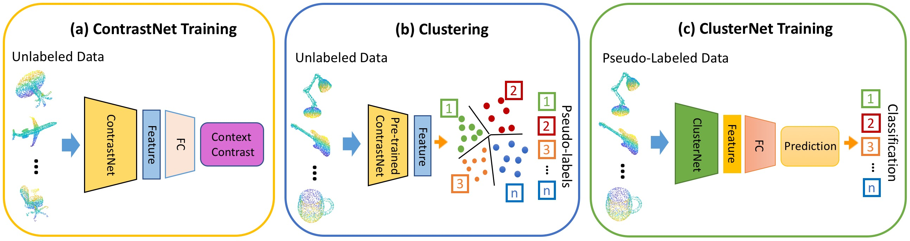

# Unsupervised Feature Learning for Point Cloud by Contrasting and Clustering With Graph Convolutional Neural Network
We propose an unsupervised learning approach to learn features from unlabeled point cloud "3D object" dataset by using part contrasting and object clustering with deep graph neural networks (GNNs).

This paper is accepted by [3DV](http://3dv19.gel.ulaval.ca) 2019. [[Paper]](https://arxiv.org/abs/1904.12359)  

The short version for this paper is accepted by [CVPRW](https://scene-understanding.com) 2019.  [[Short Version Paper]](https://scene-understanding.com/papers/ContrastNet_CVPRW.pdf)

## Pipeline
To learn features from unlabeled point cloud data, we propose to learn features by training networks to accomplish both of the part contrasting and the object clustering pretext tasks. The pipeline of our framework is illustrated in the Figure, which includes three major steps: ContrastNet for part contrast learning, clustering using the learned features, and then ClusterNet for object cluster learning using the cluster IDs. 

  

## Requirements
* [TensorFlow](https://www.tensorflow.org/), Matlab


## Process Data

- For ModelNet40,  run script `gen_modelnet40_cut2_hdf5.m` using Matlab.

- For ShapeNet,  run script `gen_shapenet_cut2_hdf5.m`  using Matlab.
- Then run script `gen_filesnames.m`  using Matlab. Need to change the files path in gen_filesnames.m  file to the corresponding name of datasets.

## ContrastNet
* Run the training script:
``` bash
python train_contrastnet.py
```
* Run the evaluating script after training finished:
```
python evaluate.py
```

* Run the extracting script after training finished (uncomment the ContrastNet model):
``` bash
python extract_training_feat.py

python extract_testing_feat.py
```

- Run the classifier script after extracting finished:

```
python SVM.py
```

## ClusterNet

- Run the clustering script (for sure the train_feature.txt file in current pathway):

```
Python KMeans.py
```

- Run the training script:

```bash
python train_clusternet.py
```

- Run the extracting script after training finished (uncomment the ClusterNet model):

```bash
python extract_training_feat.py

python extract_testing_feat.py
```

- Run the classifier script after extracting finished:

```
python SVM.py
```

## Other Tools

- To visualize features using TSNE (for sure the feature.txt and label.txt files in current pathway), run the following code:

```
python visualize_TSNE.py
```

- To visualize the topk closest object (for sure the closed_index.txt file generated by KMeans.py in current pathway), run `visualize_closest.m` using matlab.

## License

MIT License

## Acknowledgement
This code is based on [PointNet](https://github.com/charlesq34/pointnet) and [DGCNN](<https://github.com/WangYueFt/dgcnn>).
